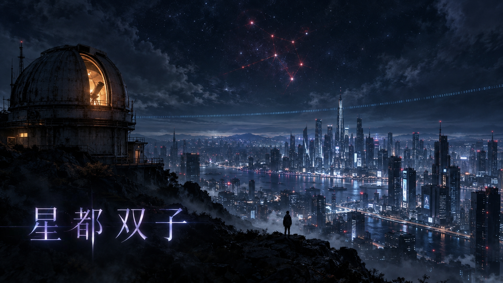

<div align="center">



# 星都双子

**一款纯网页互动游戏（WIG）· 悬疑 / 科幻 / 反乌托邦**

这座城市官方宣称：没有失踪，没有意外，没有双子。
直到那封邮件亮起。

**▶ [立即游玩](https://rwxwswig.github.io/xingduWIG.github.io/)**

电脑 / 平板 / 手机均可游玩 · 建议佩戴耳机

</div>

---

## 📖 故事简介

2066年10月，星都市。

四千万人安睡在一座由摄像头与信用积分编织的城市里。这里的词条会"复审"，新闻会"消失"，每个孩子十八岁那年都要赴一场名为「成人礼」的测试——通不过的，由政府统一安排「海外深造」。

费用全免。家长无需探望。
**孩子从此不再寄明信片回来。**

没有人觉得奇怪。

你是《星都观察者》刚入职的实习记者。你的第一项任务，本来是写一篇《智慧城市便民措施》的通稿。

直到凌晨，一封匿名邮件亮起——

> 「我爸妈消失了。四天了。
> 他们说去临港参加交流会，两天就回。
> 高铁票买好了——可座位号是空的，他们根本没上车。
> 公司说他们请了年假。不可能，我妈的年假从来都攒着不舍得用。
> 楼下便利店的人说，有个穿黑西装的男人，一直在打听我爸妈。
> 记者，我不敢报警。求求您，回我。」

你以为是寻常的家庭纠纷。

可当你回复了那个少年，越过那道需要邀请码的论坛防火墙，点开一张看似普通的全家福——

照片角落的镜子里，映着门口的另一个人影。
**正冷冷地看着镜头。**

这座城市没有失踪案。
因为你查到的每一条线索，最后都指向同一个词——
一个在百科上被标注「复审通过：不存在」的词。

搜索、对话、解密、潜入。
桌面上每一个图标，都是真相的一块碎片。
而当你终于拼出全貌，等待你的不是头条，而是一道没有人能替你做的选择题——

按下去，有人得救，有人消失。
不按，你会安稳地活下去，带着你今晚知道的一切。

**星都 OS 2066 已就绪。是否登录？**

---

## ✨ 特性

- 🖥️ **桌面 OS 仿真玩法** — 整个游戏运行在一台 2066 年的"政务云电脑"上：窗口、任务栏、文件管理器、浏览器、邮箱、即时通讯，全是可交互的应用
- 🔍 **真解谜** — 线索需要主动"搜索"与"对话"解锁，普通难度无任何提示，纯靠自己
- 🎭 **三个结局** — 最后的抉择没有人能替你做；通关后可快速重玩，体验其他结局
- 📱 **全端适配** — 响应式设计，手机触屏（拖拽 / 翻转 / 点击）完整支持
- 🔊 **语音与氛围** — 角色语音留言、摩斯电码等音频线索，建议佩戴耳机
- 🚫 **零依赖** — 纯 HTML / CSS / JavaScript，无需安装、无需后端，打开即玩

## 🎮 游戏信息

| 项目 | 说明 |
| --- | --- |
| 类型 | 网页互动游戏（WIG）· 悬疑 / 科幻 / 反乌托邦 |
| 时长 | 单局约 30–45 分钟 |
| 结局 | 3 个 |
| 难度 | 简单（含目标提示）/ 普通（无辅助） |
| 平台 | 电脑 / 平板 / 手机（浏览器） |
| 玩家反馈 | [填写玩家问卷](https://v.wjx.cn/vm/wFWZB0W.aspx) |

## 🕹️ 上手提示

<details>
<summary>怕卡关可以点开看（轻微剧透）</summary>

- 剧情线索需要"搜索"与"对话"来解锁，别忘了和邮件里的人**回复互动**
- 有些证据藏得很深——试试**点击照片**、查看**文件属性**
- 桌面上每一个图标都值得点开看看
- 实在卡关，可参考仓库中的 [Strategy Guide.html](Strategy Guide.html)（通关攻略）
</details>

## 📦 本地运行

无需构建，任意静态服务器即可：

```bash
# Python
python -m http.server 8080

# 或 Node
npx serve .
```

然后访问 `http://localhost:8080`。
（手机访问可用电脑 IP，如 `http://192.168.x.x:8080`，需同一局域网）

## 🗂️ 项目结构

```
├── index.html          # 入口页面（启动屏 / 简介 / 各界面结构）
├── style.css           # 全部样式（含移动端媒体查询）
├── game.js             # 游戏逻辑（窗口系统 / 剧情 / 解谜 / 结局）
├── assets/             # 图片、语音、音频线索
├── Strategy Guide.html # 通关攻略
└── 作品简介.txt         # 各版本宣传文案
```

## ⚠️ 声明

本游戏内容纯属虚构，与现实世界任何人、事、机构无关。
部分素材由 AI 生成。

---

<div align="center">

**星都观察者 · 为沉默者发声**

▶ [开始游玩](https://rwxwswig.github.io/xingduWIG.github.io/) · 📝 [填写问卷](https://v.wjx.cn/vm/wFWZB0W.aspx)

</div>
